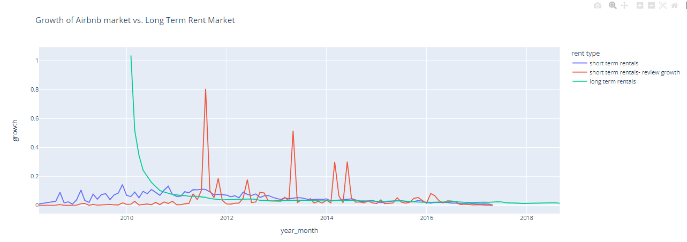
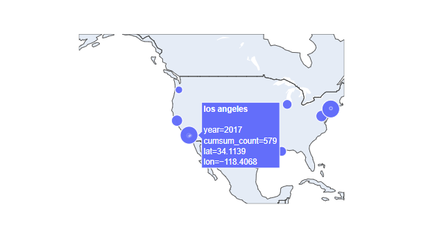

# The_Airbnb_housing_market
Final project completed for the course "The Art of Analyzing Big Data".

## [Final Project](The_Airbnb_housing_market.ipynb)

In this project, our main focus in on the exploration of the Airbnb housing market and its impact on the long-term rental market. We explored the Airbnb market, tried to answer a few interesting questions, and compared the long term and the short term rental markets.

